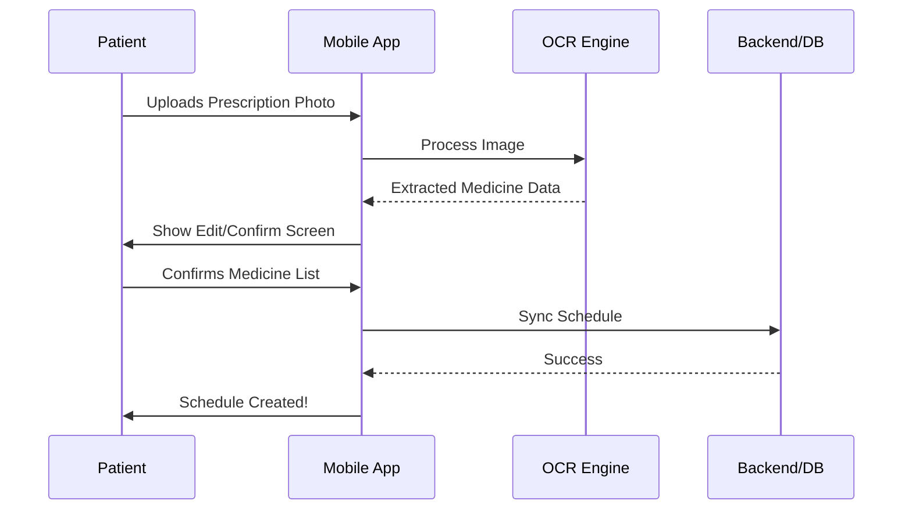
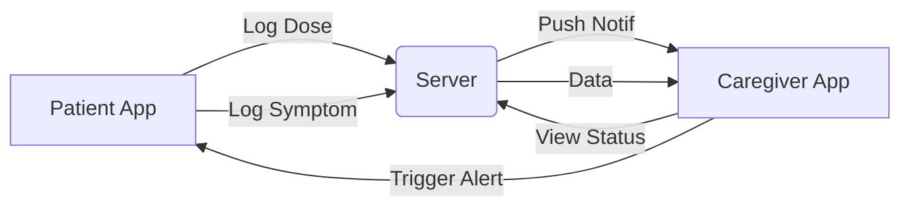

# 🏥 Discharge-Buddy: Proposed Solution & Architecture

This document outlines the core architecture and user flows for **Discharge-Buddy**, a comprehensive post-discharge recovery companion designed for the **Google Solution Challenge**.

---

## 🏗️ 1. High-Level Architecture
The system is built as a **Decoupled Monolith** using React Native (Expo) for the frontend and Express (Node.js) for the backend.

```mermaid
graph TD
    subgraph "Frontend (Mobile App)"
        UI[React Native / Expo]
        Ctx[AppContext / State]
        Scan[Prescription OCR Engine]
        Anim[Reanimated Mascot]
    end

    subgraph "Backend (API Server)"
        API[Express.js Server]
        Auth[JWT / Google OAuth]
        Logic[Recovery Logic Services]
    end

    subgraph "Storage"
        DB[(PostgreSQL / Drizzle)]
        Cache[(Local AsyncStorage)]
    end

    UI <--> Ctx
    Ctx <--> API
    API <--> DB
    Ctx <--> Cache
    Scan --> UI
```

---

## 🔄 2. Core User Flows

### A. Prescription Onboarding
How a patient digitizes their discharge instructions.

### B. Caregiver Monitoring
How a family member keeps track of a loved one's recovery.

---

## 🎨 3. UI/UX Strategy
1. **Gamification**: Using XP, Streaks, and Levels to encourage adherence.
2. **Supportive Companion**: A Duolingo-style mascot (Beary) that reacts emotionally to the patient's progress.
3. **Emergency Ready**: A one-tap emergency trigger that notifies caregivers and provides a digital medical card.

---

## 💎 5. Detailed Feature Breakdown

### 📱 Patient Experience (The Recovery Companion)
- **Role-Based Access**: Adaptive UI based on user role (Patient/Caregiver).
- **AI Prescription Onboarding**: Upload -> OCR -> Manual Edit -> Confirmation.
- **Structured Schedule**: Daily medicine timeline (Morning/Afternoon/Night).
- **Smart Reminders**: Notification actions for "Taken", "Missed", or "Snooze".
- **Simplified Instructions**: NLP-driven medical jargon simplification.
- **Symptom & Mood Logger**: One-tap interface for tracking recovery progress.
- **Emergency System**: One-tap SOS button that notifies all linked caregivers.
- **Gamified Recovery**: Adherence XP, 7-day streaks, and mascot evolution.
- **Multilingual Support**: Fully localized in English, Hindi, and Spanish.

### 👥 Caregiver Portal (The Guardian Interface)
- **Real-Time Monitoring**: Live adherence dashboard for the linked patient.
- **Critical Alerts**: Instant push notifications for missed doses or abnormal symptoms.
- **Activity Timeline**: Transparent history of all patient interactions.
- **Quick Action Center**: One-tap buttons to call patient, send manual reminders, or trigger emergency response.
- **Secure Linking**: Secure patient-caregiver association via email/phone invites.

### 🧠 Backend Intelligence (The Logic Core)
- **OCR & NLP Engine**: Text extraction and medical entity parsing from prescription images.
- **Intelligent Scheduler**: Auto-generation of medicine reminders based on parsed frequency.
- **Risk Detection Engine**: Pattern analysis of symptoms and missed doses to predict health risks.
- **Real-Time Sync**: Socket-based updates ensuring caregiver dashboards are always current.
- **Secure Storage**: Encrypted medical data and authentication (JWT).

---

## 🖼️ 6. System Wireframes & Blueprints
The following wireframes visualize the integrated solution architecture:

1. **[Patient System Wireframe](file:///D:/hdd/GDG(App)/Discharge-Buddy/PPT%20Assests/patient_wireframe.png)**: Visualizing the patient journey from OCR to Dashboard.
2. **[Caregiver System Wireframe](file:///D:/hdd/GDG(App)/Discharge-Buddy/PPT%20Assests/caregiver_wireframe.png)**: Mapping the monitoring and alert ecosystem.
3. **[Backend Architecture Blueprint](file:///D:/hdd/GDG(App)/Discharge-Buddy/PPT%20Assests/backend_wireframe.png)**: Deep dive into the data processing and sync logic.
